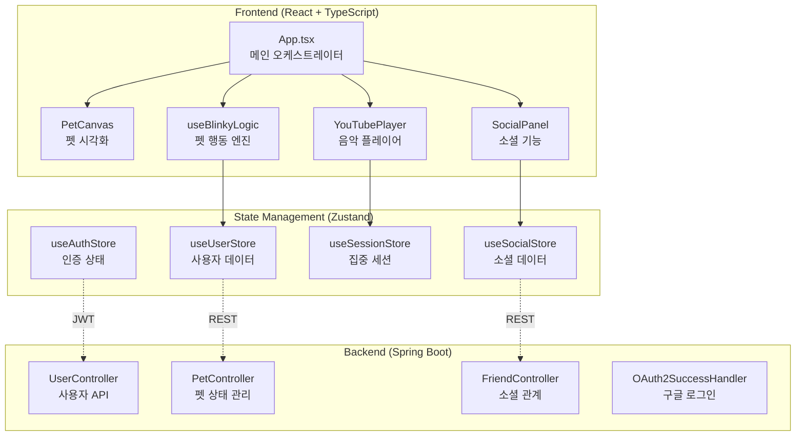

# Blinky - 개발자용 소셜 다마고치

> **"눈 깜빡이는 걸 잊은 당신을 위한, 개발자용 소셜 다마고치"**

모니터에 몰입한 개발자의 눈 건강을 지키고, 음악으로 노동요를 공유하는 데스크테리어 위젯입니다.

---

## 🎯 프로젝트 개요

**Blinky**는 장시간 코딩으로 지친 개발자들을 위한 **시력 보호 지원 플랫폼**으로, 가상 펫 시스템을 통해 눈 휴식을 유도하고 소셜 기능으로 동료들과 음악을 공유합니다.

### 핵심 가치
- **눈 건강 보호**: 펫의 심심함 시스템을 통해 잠시 눈을 쉴 수 있는 환경을 제공
- **집중력 향상**: 음악 플레이어로 작업 흐름 유지
- **소셜 연결**: 팀원들과의 음악 공유 및 상태 확인

---

## 🏗️ 기술 아키텍처

### 시스템 구조도



### 주요 기술 스택

| 구분 | 기술 | 버전 | 용도 |
|------|------|------|------|
| **Frontend** | React | 18.2.0 | UI 컴포넌트 프레임워크 |
| | TypeScript | 5.0.2 | 타입 안전 개발 |
| | Zustand | 5.0.9 | 경량 상태 관리 |
| | Tailwind CSS | 3.4.19 | 유틸리티 CSS 프레임워크 |
| | Framer Motion | 12.23.26 | 애니메이션 라이브러리 |
| **Backend** | Spring Boot | - | REST API 서버 |
| | JPA/Hibernate | - | 데이터베이스 ORM |
| | Spring Security | - | 인증/인가 처리 |
| | OAuth2 | - | 구글 로그인 연동 |

---

## ✨ 핵심 기능 구현

### 1. 🐈 스마트 펫 시스템

#### 펫 상태 메커니즘
펫은 **심심함(boredom)** 과 **행복도(happiness)** 두 가지 지표를 통해 사용자의 상태를 반영합니다.

```java
// Pet.java - 펫 상태 계산 로직
private static final double BOREDOM_INCREASE_RATE = 0.028; // 초당 증가율
private static final double HAPPINESS_DECREASE_RATE = 0.00055; // 초당 감소율

public double getCalculatedBoredom() {
    if (this.lastUpdated == null) return this.boredom;
    long secondsPassed = between(this.lastUpdated, LocalDateTime.now()).getSeconds();
    double addedBoredom = secondsPassed * BOREDOM_INCREASE_RATE;
    return Math.min(this.boredom + addedBoredom, 100);
}
```

#### 상태 기반 행동 결정
펫의 행동은 심심함 수준에 따라 동적으로 결정됩니다

- **심각함 (boredom ≥ 100)**: alert, creep, run 중 랜덤 선택
- **보통 (50 < boredom < 100)**: walk, groom 중 선택
- **안정 (boredom ≤ 50)**: walk, idle, sleep 중 선택

### 2. 🎵 음악 플레이어 통합

#### YouTube IFrame API 활용
유튜브 영상을 재생하고 플레이리스트를 관리하는 미니멀 플레이어를 구현했습니다.

```typescript
// YouTube API 동적 로드
useEffect(() => {
  if (!window.YT) {
    const tag = document.createElement('script');
    tag.src = "https://www.youtube.com/iframe_api";
    const firstScriptTag = document.getElementsByTagName('script')[0];
    firstScriptTag.parentNode?.insertBefore(tag, firstScriptTag);
  }
}, []);
```

#### 스마트 클립보드 기능
유튜브 URL을 복사하면 자동으로 플레이리스트에 추가되는 기능으로, 개발자의 작업 흐름을 방해하지 않습니다.

### 3. 🌐 소셜 기능

#### 팔로우 시스템
사용자 간의 팔로우/팔로워 관계를 관리하는 소셜 네트워크 기능을 구현했습니다.

```java
@PostMapping
public ResponseEntity<Void> toggleFollow(
        @RequestParam String email,
        Principal principal
) {
    friendService.toggleFollow(email, principal);
    return ResponseEntity.ok().build();
}
```

#### 실시간 상태 공유
친구들의 현재 음악 감상 상태와 펫 상태를 실시간으로 확인할 수 있습니다.

---

## 📊 상태 관리 아키텍처

### Zustand 스토어 구조
도메인별로 5개의 스토어를 분리하여 관리합니다

| 스토어 | 역할 | 주요 상태 |
|------|------|----------|
| `useAuthStore` | 인증 관리 | `token`, `setToken`, `logout` |
| `useUserStore` | 사용자 데이터 | `userStats`, `fetchStats`, `updateAfterSession` |
| `useSessionStore` | 집중 세션 | `sessionTime`, `startTime`, `currentVideoIds` |
| `useUIStore` | UI 상태 | `isSettingsOpen`, `isSocialOpen` |
| `useSocialStore` | 소셜 데이터 | `lists`, `friendStatus`, `fetchFriendsList` |

### 세션 생명주기 관리
집중 세션은 시작부터 종료까지의 전체 과정을 추적합니다

```typescript
const handleEndSession = useCallback(async () => {
  if (!userStats || !startTime || sessionTime < 5) {
    resetSession();
    return;
  }
  try {
    const data = await sendEnd(startTime, currentVideoIds, stats.happiness, stats.boredom, token);
    if (data?.totalFocusTime !== undefined) {
      updateAfterSession(data.totalFocusTime, stats.happiness, stats.boredom);
    }
    resetSession();
  } catch (error) {
    console.error("세션 저장 실패:", error);
  }
}, [userStats, startTime, sessionTime, currentVideoIds, stats, token, resetSession, updateAfterSession]);
```

---

## 🔧 개발 환경 설정

### Frontend
```bash
cd front
npm install
npm run dev  # http://localhost:5173
```

### Backend
```bash
cd back
./mvnw spring-boot:run  # http://localhost:8080
```

### 환경 변수
```bash
# .env
VITE_BASE_URL=http://localhost:8080
```

---

## 🎨 디자인 시스템

### 컬러 팔레트
- **사이버 그린**: `#87c587` - 주요 액션 및 상태 표시
- **딥 다크**: `#1a1c1e` - 배경 및 컨테이너
- **그린 톤**: `#557a55` - 보조 배경

### 타이포그래피
- **폰트**: Monospace 계열 (개발자 친화적)
- **특징**: `font-mono`, `font-black`, `tracking-[0.2em]` 적용

---

## 🚀 기술적 도전 과제

### 1. 실시간 상태 동기화
- **문제**: 프론트엔드와 백엔드의 펫 상태 동기화
- **해결**: 낙관적 업데이트 + 주기적 동기화 패턴 적용
- **구현**: `useBlinkyLogic` 훅에서 38초마다 자동 증가

### 2. 세션 데이터 지속성
- **문제**: 브라우저 종료 시 세션 데이터 유실
- **해결**: `beforeunload` 이벤트 리스너로 자동 저장

### 3. API 인증 처리
- **문제**: JWT 토큰 만료 시 자동 로그아웃
- **해결**: Axios 인터셉터로 401 에러 처리

---

## 📈 성능 최적화

### 프론트엔드
- **상태 관리**: Zustand로 불필요한 리렌더링 방지
- **애니메이션**: Framer Motion으로 GPU 가속 활용
- **코드 분할**: 동적 import로 초기 로딩 최적화

### 백엔드
- **DTO 패턴**: 응답 데이터 최적화
- **지연 로딩**: JPA 연관관계 최적화
- **캐싱**: 펫 상태 계산 결과 캐싱

---

## 🔮 향후 개선 계획

- [✅] SSE를 통한 실시간 음악 공유
- [❎] 사용자 커스텀 눈 건강 알림 설정
- [ ] 펫 커스터마이징 기능
- [📝] 팀 단위 집중 시간 대시보드

---

## 💡 배운 점

1. **상태 관리**: 복잡한 상태를 도메인별로 분리하여 관리하는 방법
2. **API 설계**: RESTful API와 실시간 기능의 조합
3. **사용자 경험**: 게이미피케이션을 통한 사용자 참여 증대
4. **성능 최적화**: 렌더링 최적화와 네트워크 요청 관리
5. **타입 안전성**: TypeScript로 런타임 에러 방지
