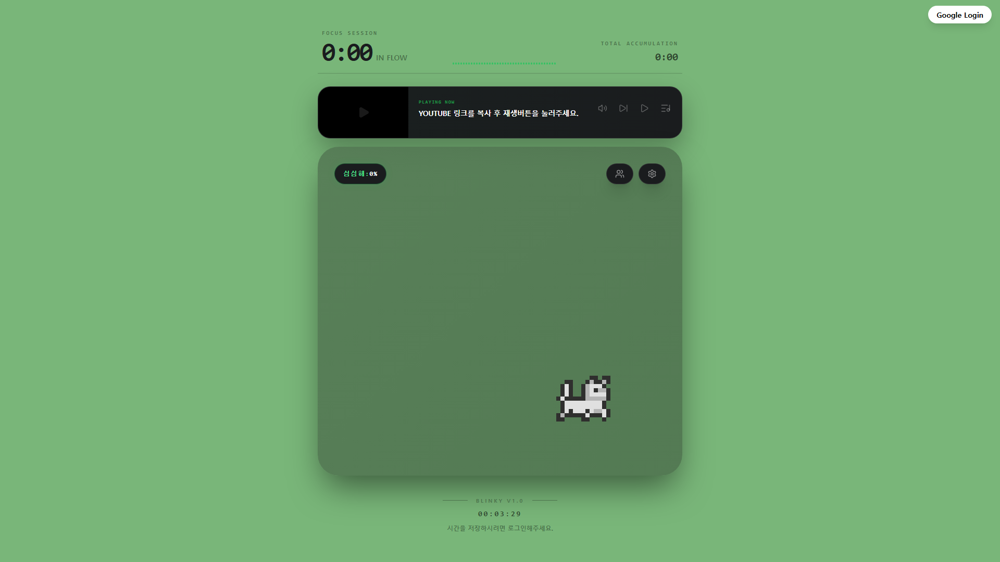

# 👁️ Blinky (블린키)

> **"눈 깜빡이는 걸 잊은 당신을 위한, 개발자용 소셜 다마고치"**
> 모니터에 몰입한 개발자의 눈 건강을 지키고, 음악으로 노동요를 공유하는 데스크테리어 위젯

---

## 📝 프로젝트 개요

**Blinky**는 장시간 코딩으로 지친 개발자들을 위한 **시력 보호 지원 플랫폼**입니다. 화면 구석에 띄워둔 귀여운 펫이 사용자의 눈 휴식 시간을 챙겨주며, 유튜브 기반의 세련된 플레이어로 작업 흐름(Flow)을 깨지 않고 음악을 즐길 수 있게 돕습니다.

### 🎯 주요 목적

* **눈 건강(Eye Care)**: 20분마다 20피트 먼 곳을 20초간 바라보는 '20-20-20 법칙' 유도
* **음악 공유(Social Music)**: 혼자 하는 코딩이 아닌, 동료들의 플레이리스트와 함께하는 즐거움
* **데스크테리어(Desk-Interior)**: 터미널 감성의 세련된 UI로 개발 환경의 멋을 더함

---

## ✨ 핵심 기능

### 1. 🐈 스마트 펫 '블린키' (Blinky Pet)

* **상태 동기화**: 개발자가 집중하고 있을 때는 같이 집중하고, 휴식이 필요할 땐 그루밍을 하며 주의를 환기합니다.
* **인터랙티브 캔버스**: 마우스 클릭에 반응하는 애니메이션을 통해 코딩 중 소소한 힐링을 제공합니다.
* **상태 표시 칩**: 왼쪽 상단의 `STATUS` 위젯을 통해 현재 시스템 상태를 직관적으로 확인합니다.

### 2. 🎵 노동요 큐레이션 플레이어

* **심플 위젯 UI**: 왼쪽 30% 영상 피드, 오른쪽 70% 제어 영역으로 구성된 미니멀 플레이어입니다.
* **스마트 클립보드**: 유튜브 URL을 복사만 하면 `Plus` 버튼으로 리스트 추가, `Play` 버튼으로 즉시 재생이 가능합니다.
* **슬라이딩 제목 애니메이션**: Framer Motion을 적용해 곡이 바뀔 때마다 전광판처럼 매끄럽게 제목이 교체됩니다.

### 3. 🌐 소셜 대시보드 (준비 중)

* **동료 상태 확인**: `STATS`, `SOCIAL` 버튼을 통해 팀원들의 펫 상태를 확인하고 응원을 보낼 수 있습니다.
* **실시간 공유**: 현재 내가 듣고 있는 최고의 '노동요'를 팀원들에게 공유합니다.

---

## 🛠 기술 스택

* **Backend**: 
* **Frontend**: React, TypeScript, Tailwind CSS
* **Animation**: Framer Motion (애니메이션), CSS Keyframes
* **Icons**: Lucide-react
* **Media**: YouTube IFrame Player API

---

## 🎨 디자인 컨셉

* **색상**: 사이버 그린(`#87c587`) & 딥 다크(`#1a1c1e`)
* **폰트**: 개발자에게 익숙한 Monospace 계열 폰트 사용
* **스타일**: 유리창 너머를 보는 듯한 `Backdrop Blur` 효과와 세련된 캡슐형 버튼 디자인

---

## 📅 로드맵

* [x] 펫 캔버스 및 상태 제어 시스템 구축
* [x] 유튜브 미니 플레이어 UI 개발
* [x] Framer Motion 기반 제목 전환 효과 적용
* [ ] 사용자 커스텀 시력 보호 알림 기능
* [ ] 소셜 친구 목록 및 실시간 음악 공유 서버 연동

---

**Blinky**와 함께 눈 건강도 챙기고 즐겁게 코딩하세요! 💻✨

---
