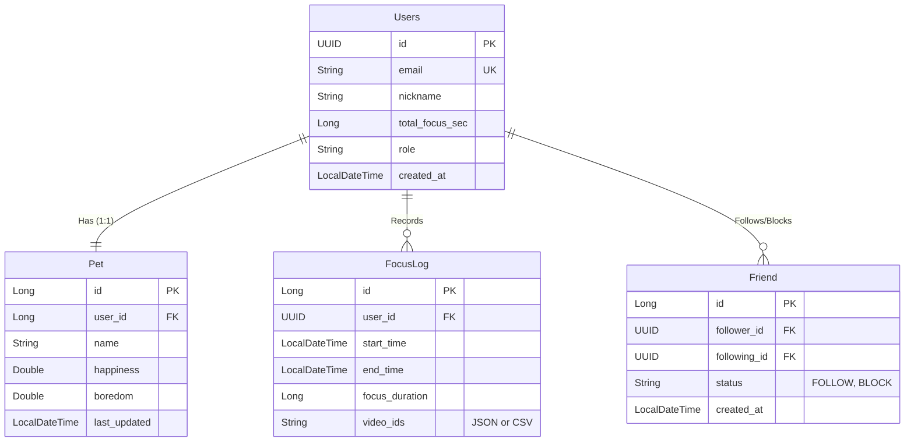

# 데이터베이스 스키마 (Database Schema)

## 📊 ER 다이어그램 (ER Diagram)

## 📝 엔티티 상세 (Entity Details)

### 1. User (사용자)

- **id**: UUID, Primary Key.
- **email**: 사용자 이메일 (로그인 ID).
- **total_focus_sec**: 총 집중 시간 누적 (초 단위).
- **pet**: 1:1 관계의 펫 엔티티.
- **focusLog**: 자신의 집중 기록 리스트.
- **followingList / followerList**: 친구 관계 리스트.

### 2. Pet (펫)

- **user**: 주인(User).
- **happiness**: 행복도 (0~100). 시간이 지나면 자동 감소.
- **boredom**: 심심함 (0~100). 시간이 지나면 자동 증가.
- **Methods**: `getCalculatedBoredom()`, `getCalculatedHappiness()` - 시간 경과에 따른 상태를 실시간으로 계산.

### 3. Friend (친구 관계)

- **follower**: 팔로우를 건 사람.
- **following**: 팔로우를 받은 사람.
- **status**: 관계 상태 (`FOLLOW`, `BLOCK`).

### 4. FocusLog (집중 기록)

- **start_time / end_time**: 세션 시작/종료 시각.
- **focus_duration**: 실제 집중 시간 (초). `end - start`와 다를 수 있음 (일시정지 등 고려 시).
- **video_ids**: 해당 세션에서 시청한 영상 ID 목록.
