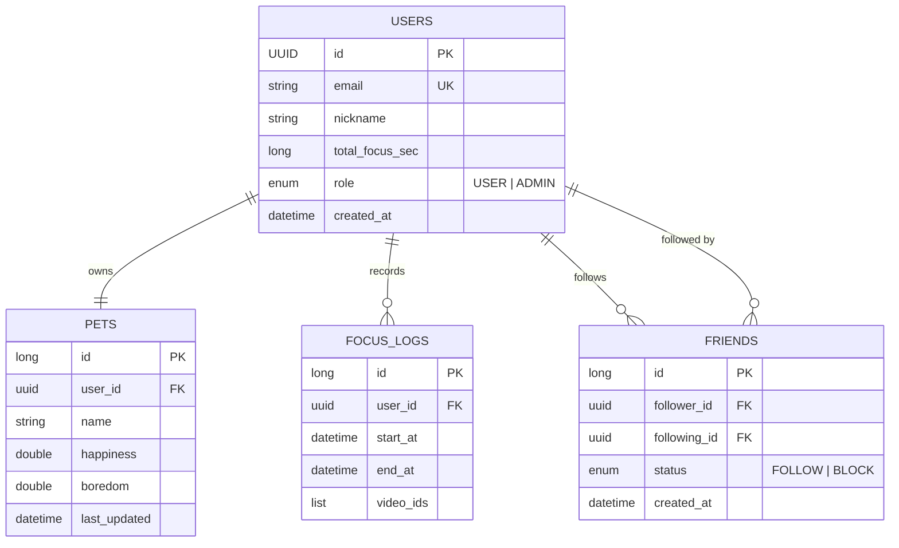

# 데이터베이스 스키마

## 1. ER Diagram (Logic)

## 2. Table Details

### Users (`users`)

- **id**: UUID, Primary Key.
- **email**: 사용자 이메일 (Unique, Not Null).
- **nickname**: 닉네임 (Not Null).
- **total_focus_sec**: 누적 집중 시간 (초 단위, Default 0).
- **role**: 사용자 권한 (`USER`, `ADMIN`).
- **created_at**: 가입 일시.

### Pets (`pet`)

- **id**: Long (Auto Increment), PK.
- **user_id**: 외래키 (User), 1:1 관계.
- **name**: 펫 이름.
- **happiness**: 행복도 수치.
- **boredom**: 심심함 수치.
- **last_updated**: 마지막 상태 변경 시간 (상태 계산용).

### FocusLogs (`focus_log`)

- **id**: Long, PK.
- **user_id**: 외래키 (User).
- **start_at / end_at**: 집중 시작/종료 시간.
- **video_ids**: 시청한 비디오 ID 목록 (별도 컬렉션 테이블 `focus_log_videos`에 저장).

### Friends (`friends`)

- **id**: Long, PK.
- **follower_id**: 팔로우 하는 유저.
- **following_id**: 팔로우 받는 유저.
- **status**: 관계 상태 (`FOLLOW`, `BLOCK`).
- **Constraint**: `follower_id`와 `following_id` 조합은 유니크해야 함.
